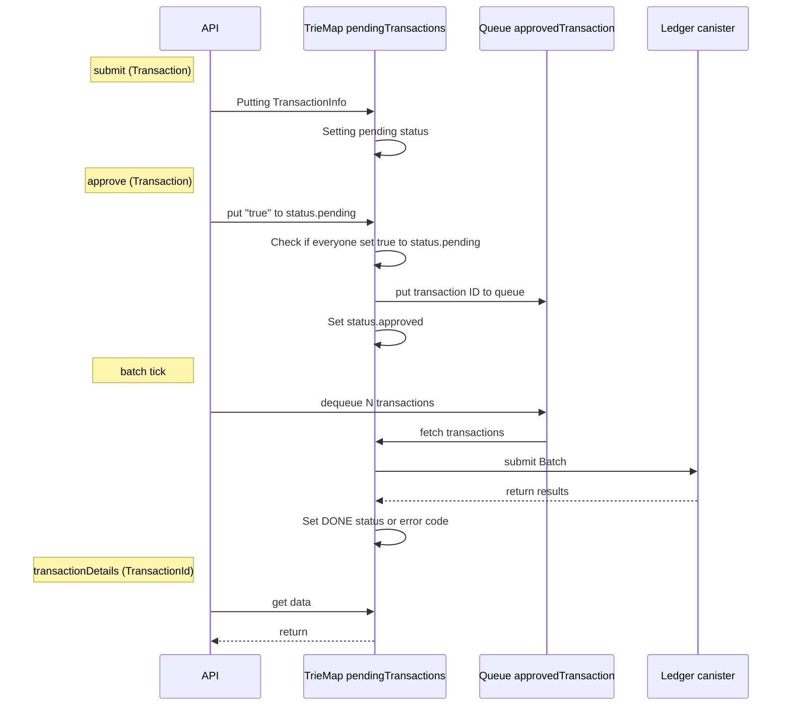

<h1 align="center">
    
     __  __     ______   __        
    /\ \_\ \   /\  == \ /\ \       
    \ \  __ \  \ \  _-/ \ \ \____  
     \ \_\ \_\  \ \_\    \ \_____\
      \/_/\/_/   \/_/     \/_____/
</h1>

<h4 align="center">A high performance ledger on the Internet Computer.</h4>

<p align="center">
  <a href="#about">About</a> •
  <a href="#features">Features</a> •
  <a href="#api">API</a> •
  <a href="#architecture">Architecture</a> •
  <a href="#deployment">Deployment</a> •
  <a href="#contributing">Contributing</a> •
  <a href="#credits">Credits</a> •
  <a href="#support">Support</a> •
  <a href="#license">License</a>
</p>

---

## About

The goal is to design and demonstrate a ledger on the IC(https://internetcomputer.org/) that can handle 10,000 transactions per second which are submitted individually by different end users via ingress messages. The number of ingress messages that the consensus mechanism of a single subnet can process is only in the order of 1,000 per second and is in fact rate limited by boundary nodes to a lower number (maybe around 400 per second). Therefore, to get to the desired throughput we plan to utilize 25 subnets.

The approach we take is based on the assumption that consensus is indeed the bottleneck and that computation and memory are not bottlenecks. Our approach has a single ledger canister which stores all account balances and settles all transactions. Transactions are not submitted to the ledger directly, though. Instead, end users submit their transactions to aggregators of which there are 25, all on different subnets. Aggregators batch up the transactions and forward them in batches to the ledger. The bottleneck is now the block space available for incoming cross-subnet messages on the subnet that hosts the ledger. If the size of a simple transaction is 100 bytes then each aggregator submits 40kB of data per second to the ledger. For all aggregators combined this occupies 1 MB of block space per second.

With some compression techniques we expect that the size of a simple transaction can be reduced to be around 20 bytes, which means a block space requirement of only 200 kB per second.

We expect the computational resources required to check 10,000 account balances and update 20,000 account balances per second to be within what a single canister can do.

We expect the memory resources required to store 100 million account balances to be within what a single canister can do.

We do not expect the ledger to be able to store the history of transactions, but this is not an argument against the design of having a single ledger canister. In fact, even distributing the ledger over 25 subnets would not change the fact that storing the entire history of transactions on chain is impossible. At 10,000 tps and 20 bytes per transaction the history grows by >500 GB per month. Therefore we propose to store only recent history in the ledger canister. The entire history has to be archived off chain but can always be authenticated against root hashes that are stored in the ledger.

## Features

The ledger is a multi-token ledger. This means that multiple tokens, differentiated from each other by a token id, can be hosted on the same ledger canister.

All transactions need to be explicitly approved by all parties involved, even the receiver. There are no deposits into arbitrary accounts without approval of the receiver.

Multiple token flows can happen atomically in a single transaction.

More than two parties can be part of a single transaction and all have to approve.

Any party can initiate the transaction: the sender, the receiver or even a third-party. The initiator is paying the fee.

## API

- [Terminology](#terminology)
- [Candid types of the API](#data-types)
- [Ledger API](#ledger-api)
  - [Get number of aggregators](#get-number-of-aggregators)
  - [Get aggregator principal](#get-aggregator-principal)
  - [Get number of open subaccounts](#get-number-of-open-subaccounts)
  - [Open new subaccount](#open-new-subaccount)
  - [Check balance](#check-balance)
  - [Process Batch](#process-batch)
- [Aggregator API](#aggregator-api)
  - [Initialize transaction](#initialize-transaction)
  - [Approve transaction](#approve-transaction)
  - [Reject transaction](#reject-transaction)
  - [Get transaction status](#get-transaction-status)

### Terminology

**Canister** - conceptual computational unit, executes program in the Internet Computer blockchain [Read More](https://wiki.internetcomputer.org/wiki/Canisters_(dapps/smart_contracts))

**Principal** - an identifier for an entity on the IC such as a user, a canister (dapps/smart contracts), or a subnet. [Read More](https://wiki.internetcomputer.org/wiki/Principal)

**Subaccount** - essentially a wallet, owned by one principal and containing one type of tokens. Client principal can have many subaccounts with different and/or the same tokens 

### Candid types of the API

Id of token, e.g. currency
```motoko
type TokenId = nat;
```

Id of aggregator
```motoko
type AggregatorId = nat;
```

Balances are Nats in the smallest unit of the token.
```motoko
type Balance = nat;
```

Subaccount ids are issued in consecutive order, without gaps, starting with 0. Extending the range of subaccount ids is an infrequent administrative action on the ledger carried out by the owner principal of the subaccounts.
```motoko
type SubaccountId = nat;
```

Id of transaction, issued by aggregator. The first value specifies the aggregator who issued the transaction id. The second value (nat) is a locally unique value chosen by the aggregator.
```motoko
type TransactionId = record { AggregatorId; nat };
```

```motoko
type Transaction = vec Part;
```

```motoko
type Batch = vec Transaction;
```

```motoko
type Part = record {
  owner : principal;
  flows : vec Flow;
  memo : opt blob
};
```

```motoko
type Flow = record {
  token : TokenId;
  subaccount : nat;
  amount : int;
};
```

A record of type `Part` is only valid if in the sequence of flows the `subaccount` field is strictly increasing. In particular, there can be at most one flow per subaccount. 

### Ledger API

- #### Get number of aggregators

  **Endpoint**: `nAggregators: () -> (nat) query;`

  **Authorization**: `public`

  **Description**: returns amount of running aggregator canisters

  **Flow**:
  - return `aggregators.size()`

- #### Get aggregator principal

  **Endpoint**: `aggregatorPrincipal: (AggregatorId) -> (principal) query;`

  **Authorization**: `public`

  **Description**: returns principal of selected aggregator. Provided `nat` is an index and has to be in range `0..{nAggregators()-1}`

  **Flow**:
  - return `aggregators[aggregatorId]`
  
- #### Get number of open subaccounts

  **Endpoint**: `nAccounts: () -> (nat) query;`

  **Authorization**: `account owner`

  **Description**: returns the number of open subaccounts for the caller
  
  **Flow**:
  - obtain `ownerId`: `owners.get(msg.caller)`. If it's not defined, return error
  - return `balances[ownerId].size()`

- #### Open new subaccount

  **Endpoint**: `openNewAccounts: (TokenId, nat) -> (SubaccountId);`

  **Authorization**: `account owner`

  **Description**: opens N new subaccounts for the caller and token t. It returns the index of the first new subaccount in the newly created range

  **Flow**:
  - obtain `ownerId`: `owners.get(msg.caller)`. If it's not defined:
    - create it: `ownerId = owners.size()`
    - put to the map: `owners.put(msg.caller, ownerId)`
    - init balances: `balances[ownerId] = []`
  - extract subaccount array `var tokenBalances = balances[ownerId]`
  - remember `tokenBalances.size()`
  - append N new `TokenBalance` entries `{ unit: tokenId, balance: 0}` to `tokenBalances`
  - return original array size

- #### Check balance
  
  **Endpoint**: `balance: (SubaccountId) -> (TokenBalance) query;`

  **Authorization**: `account owner`

  **Description**: returns wallet balance for provided subaccount number

  **Flow**:
  - obtain `ownerId`: `owners.get(msg.caller)`. If it's not defined, return error
  - return `balances[ownerId][subaccountId]`

- #### Process Batch

  **Endpoint**: `processBatch: (Batch) -> (vec TransactionId, nat);`

  **Authorization**: `cross-canister call from aggregator`

  **Description**: processes a batch of newly created transactions. Returns statuses and/or error codes
  
  **Error codes**:
  - (1): account not found
  - (2): subaccount not found
  - (3): token unit mismatch
  - (4): non-sufficient funds
  - (5): token flows do not add up to zero
  - (6): flows are not properly sorted

  **Flow**:
  - check `msg.caller` - should be one of registered aggregators
  - initialize array `result`: can contain either transactionId or error code
  - loop over each `transaction` in `batch`:
    - init cache array of owners `transactionOwners = []` for faster access later
    - init token amount balance map `tokenBalanceMap: Map<TokenId, Int> = ...` for checking that the flows for each 
    token add up to zero
    - loop over each `part` in `transaction` (pass #1: validation):
      - obtain `ownerId`: `owners.get(part.owner)`. If it's not defined, put error code `1` to `result` and continue 
      outer loop. Else push `ownerId` to `transactionOwners` cache array
      - set `last_subaccount` to -1
      - loop over each `flow` in `part`
        - assert that the `flow.subaccount > last_subaccount`. If not set an error code `6` and continue outer loop.
	    - set `last_subaccount` to `flow.subaccount`
        - get appropriate balance: `var tokenBalance = balances[ownerId][flow.subaccount]`. If not found, put error 
        code `2` to `result` and continue outer loop
        - assert `tokenBalance.unit == flow.token` else put error code `3` to `result` and continue outer loop
        - if `tokenBalance.balance + flow.amount < 0`, put error code `4` to `result` and continue outer loop
        - add `flow.amount` to `tokenBalanceMap.get(flow.token)`, if map does not have this token, add it: `tokenBalanceMap.put(flow.token, flow.amount)`
    - loop over `tokenBalanceMap` - if any element != 0, put error code `5` to `result` and continue outer loop
    - loop over each `part` in `transaction`, use `i` as index (pass #2: applying):
      - loop over each `flow` in `part`
        - modify balance: `balances[transactionOwners[i]][flow.subaccount].balance += flow.amount`
  - return `result`

### Aggregator API

- #### Initialize transaction

  **Endpoint**: `submit: (Transaction) -> (variant { Ok: TransactionId ; Err });`

  **Authorization**: `account owner`

  **Description**: initializes transaction: saves it to memory and waits when some principal call `approve` or `reject` on it

  **Flow**:
  - construct `TransactionId`: `{ selfAggregatorIndex, transactionsCounter++ }`
  - construct `TransactionInfo` record: `{ transaction, submiter: msg.caller, status : { #pending [] } }`
  - put transaction info to pending `pendingTransactions.put(transactionId[1], transactionInfo)`
  - return `transactionId`

- #### Approve transaction

  **Endpoint**: `approve: (TransactionId) -> (variant { Ok; Err });`

  **Authorization**: `account owner`

  **Description**: approves transaction by its id

  **Flow**:
  - assert `transactionId[0] == selfAggregatorIndex`, else throw error
  - extract transaction info `var transactionInfo = pendingTransactions.get(transactionId[1])`
  - return error if either:
    - transaction not found 
    - already queued `transactionInfo.status.approved != null`
    - rejected `transactionInfo.status.rejected == true`
  - put `true` to `transactionInfo.status.pending`
  - if approveance is enough to proceed:
    - put to batch queue `approvedTransaction.enqueue(transactionId[1])`
    - set `approvedTransactions.head_number()` to `transactionInfo.status.approved`

- #### Reject transaction

  **Endpoint**: `reject: (TransactionId) -> (variant { Ok; Err });`

  **Authorization**: `account owner`

  **Description**: rejects transaction by its id

  **Flow**:
  - assert `transactionId[0] == selfAggregatorIndex`, else throw error
  - extract transaction info `var transactionInfo = pendingTransactions.get(transactionId[1])`
  - if transaction not found or already queued `transactionInfo.status.approved != null`, return error
  - put `true` to `transactionInfo.status.rejected`

- #### Get transaction status

  **Endpoint**: `transactionDetails: (TransactionId) -> (variant { Ok: TransactionInfo; Err }) query;`

  **Authorization**: `public`

  **Description**: get status of transaction or error code

  **Flow**:
  - return `pendingTransactions.get(transactionId[1])`

## Architecture

- [Context](#context-diagram)
  - [High-level user story](#high-level-user-story)
- [Containers](#containers-diagram)
  - [Low-level user story](#low-level-user-story)
- [Data structures](#data-structures)
  - [Ledger](#ledger)
  - [Aggregator](#aggregator)
    
### Context Diagram
<p align="center">
    
    <br/><span style="font-style: italic">context diagram</span>
</p>

With **HPL**, registered principals can initiate, process and confirm multi-token transactions. **HPL** charges fee for transaction

### High-level user story:

1. Principals **A** and **B** are registering themselves in **HLS**
2. Principals communicate directly to agree on the transaction details and on who initiates the transaction  (say **A**). 
3. **A** creates transaction on **HPL** and receives generated **transactionId** as response
4. **A** sends **transactionId** to **B** directly
5. *B** calls **HPL** with **transactionId** to approve the transaction
6. **HPL** asynchronously processes the transaction
7. **A** and **B** can query HPL about the status of transaction (processing, success, failed)

---
### Containers diagram
<p align="center">
    
    <br/><span style="font-style: italic">container diagram</span>
</p>

**HPL** infrastructure consists of 1 **Ledger** and N **Aggregators**. N == 25 by default
- **Aggregator** canister is an entrypoint for principals. During the transaction process, both sender and receiver principal have to use one single aggregator. The aggregator is responsible for:
    - principals authentication
    - initial transaction validation
    - charging fee
    - sending batched prepared transactions to the **Ledger**
    - receiving confirmation from the **ledger** for each transaction
    - serving transaction status to principals
- **Ledger** canister has the complete token ledger. It is the single source of truth on account balances. It settles all transactions. It cannot be called directly by principals in relation to individual transactions, only in relation to accounts. The ledger is responsible for:
  - receiving batched transactions from aggregators
  - validation and execution of each transaction
  - saving all account balances
  - saving latest transactions
  - providing list of available aggregators

### Low-level user story:

1. Principals **A** and **B** register themselves by [calling](#open-new-subaccount) ledger **L** API
2. **L** creates accounts for newly registered principals
3. **A** and **B** communicate directly to agree on the transaction details and on who initiates the transaction  (say **A**).
4. **A** [queries](#get-number-of-aggregators) available aggregators from **L** and chooses aggregator **G**
5. **A** calls a [function](#initialize-transaction) on **G** with the transaction details
6. **G** generates a **transactionId** and stores the pending transaction under this id
7. **G** returns **transactionId** to **A** as response
8. **A** sends **transactionId** and **G** principal to **B** directly
9. **B** [calls](#approve-transaction) **G** with **transactionId** to approve the transaction
10. **G** puts the transaction in the next batch
11. At the next heartbeat, **G** sends a batch of transactions in a single cross-canister [call](#process-batch) to the ledger **L**
12. **L** processes the transactions in the batch in order, i.e. executes the transaction if valid and discards it if invalid
13. **L** returns the list of successfully executed transaction ids to **G**
14. **L** returns error codes for failed transaction ids to **G**
15. **A** and **B** can [query](#get-transaction-status) **G** about the status of a transaction id (processing, success, failed)

<p align="center">
    
</p>

### Data Structures

#### Ledger
We save aggregator principals in array:
```motoko
type Aggregators = [Principal]
```

*TODO: describe when and how initialize it:*
```motoko
let aggregators = [aggregator0, aggregator1, ....]
```

For the balance we use a simple record

```motoko
type TokenBalance = {
  unit : TokenId;
  balance : Balance;
};
```

Owners are tracked via a "short id" which is a Nat.

```motoko
type OwnerId = Nat;
```

The map from principal to short id is stored in a single `RBTree`:

```motoko
let owners = RBTree<Principal, OwnerId>(Principal.compare);
```

For each principal we have a simple array of balances, indexed by `SubaccoutId`, which is being issued sequentally:

```motoko
type OwnerBalances = [TokenBalance]; // indexed by SubaccountId
```

`OwnerId` is also auto-increment value, so all the balances again can be saved in simple array:

```motoko
let balances : [OwnerBalances] = []; // indexed by OwnerId
```

This structure allows us to effectively access any subaccount balance. Particular balance is accessed as

```motoko
balances[owner_id][subaccount_id].balance
```

#### Aggregator

We save own unique identifier on each aggregator:

*TODO: describe when and how initialize it:*
```motoko
var selfAggregatorIndex: Nat = ...
```

We track transactions counter:
```motoko
var transactionsCounter: Nat = 0;
```

The main concern of the aggregator is the potential situation that it has too many approved transactions: we limit Batch 
size so the aggregator should be able to handle case when it has more newly approved transactions than batch limit between 
ticks. To avoid this, we could use [FIFO queue](https://github.com/o0x/motoko-queue) data structure for saving approved transactions. 
In this case we will transmit to ledger older transactions and keep newer in the queue, waiting for next tick. As a value 
in the queue, we use second `Nat` from `TransactionId`
```motoko
import Queue "Queue";

var approvedTransactions: Queue.Queue<Nat> = Queue.nil();
```

We need more information for each transaction, so we use this type:

```motoko
type QueueNumber = Nat;
type Approvals = [Bool];
type TransactionInfo = {
	transaction : Transaction;
	submiter : Principal;
	status : { #pending : Approvals; #approved : QueueNumber; #rejected : Bool  };
};
```
`QueueNumber` is a tail counter of the queue `approvedTransactions` at the moment, when we enqueued this transaction to it.
It will allow us to easily calculate transaction position in the queue be subtracting `approvedTransactions.head_number()` from `transactionInfo.status.approved`

`Approvals` is a vector who already approved transaction, allows for arbitrarily many parties to a Transaction

Pending transactions are being saved to `TrieMap` structure. As a key we use second `Nat` from `TransactionId`, since we do 
not care about aggregator identifier at this step. When approveing transaction, we enqueue the key `Nat` to `approvedTransactions` queue
```motoko
var pendingTrasfers: TrieMap<Nat, TransactionInfo> = ...;
```

But with this structure the logic to automatically reject old non-approved transaction could be tricky. 
So additionally we add TrieMap of pending transaction id-s, where key is principal id, value is a linked list 
of id-s of pending transaction, initiated by this principal. This will allow us to limit pending transactions per
user: if he already has, let's say, 100 pending transactions and tries to create a new one, we automatically reject
the oldest one (first in linked list). When rejecting/approveing transaction, we will acquire principal id from
Transaction (field `submiter`) object and remove appropriate transaction id from it
```motoko
var pendingPrincipalTransactions: TrieMap<PrincipalId, LinkedList<Nat>>
```


Summary lifecycle of the `Transaction` entity:


## Deployment

TBD


## Contributing

TBD

## Credits

TBD

## Support

TBD

## License

TBD
