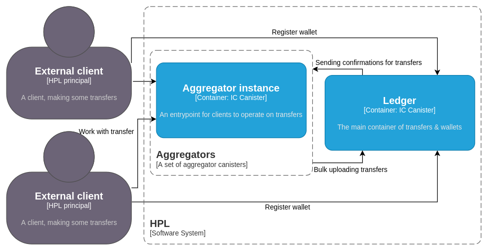

<h1 align="center">
    
     __  __     ______   __        
    /\ \_\ \   /\  == \ /\ \       
    \ \  __ \  \ \  _-/ \ \ \____  
     \ \_\ \_\  \ \_\    \ \_____\
      \/_/\/_/   \/_/     \/_____/
</h1>

<h4 align="center">A high performance ledger on the Internet Computer.</h4>

<p align="center">
  <a href="#about">About</a> •
  <a href="#features">Features</a> •
  <a href="#api">API</a> •
  <a href="#architecture">Architecture</a> •
  <a href="#deployment">Deployment</a> •
  <a href="#contributing">Contributing</a> •
  <a href="#credits">Credits</a> •
  <a href="#support">Support</a> •
  <a href="#license">License</a>
</p>

---

## About

The goal is to design and demonstrate a ledger on the IC(https://internetcomputer.org/) that can handle 10,000 transactions per second which are submitted individually by different end users via ingress messages. The number of ingress messages that the consensus mechanism of a single subnet can process is only in the order of 1,000 per second and is in fact rate limited by boundary nodes to a lower number (maybe around 400 per second). Therefore, to get to the desired throughput we plan to utilize 25 subnets.

The approach we take is based on the assumption that consensus is indeed the bottleneck and that computation and memory are not bottlenecks. Our approach has a single ledger canister which stores all account balances and settles all transactions. Transactions are not submitted to the ledger directly, though. Instead, end users submit their transactions to aggregators of which there are 25, all on different subnets. Aggregators batch up the transactions and forward them in batches to the ledger. The bottleneck is now the block space available for incoming cross-subnet messages on the subnet that hosts the ledger. If the size of a simple transfer is 100 bytes then each aggregator submits 40kB of data per second to the ledger. For all aggregators combined this occupies 1 MB of block space per second.

With some compression techniques we expect that the size of a simple transfer can be reduced to be around 20 bytes, which means a block space requirement of only 200 kB per second.

We expect the computational resources required to check 10,000 account balances and update 20,000 account balances per second to be within what a single canister can do.

We expect the memory resources required to store 100 million account balances to be within what a single canister can do.

We do not expect the ledger to be able to store the history of transactions, but this is not an argument against the design of having a single ledger canister. In fact, even distributing the ledger over 25 subnets would not change the fact that storing the entire history of transactions on chain is impossible. At 10,000 tps and 20 bytes per transaction the history grows by >500 GB per month. Therefore we propose to store only recent history in the ledger canister. The entire history has to be archived off chain but can always be authenticated against root hashes that are stored in the ledger.

## Features

The ledger is a multi-token ledger. This means that multiple tokens, differentiated from each other by a token id, can be hosted on the same ledger canister.

All transfers need to be explicitly accepted by all parties involved, even the receiver. There are no deposits into arbitrary accounts without approval of the receiver.

Multiple token flows can happen atomically in a single transfer.

More than two parties can be part of a single transfer and all have to approve.

Any party can initiate the transfer: the sender, the receiver or even a third-party. The initiator is paying the fee.

## API

- [Terminology](#terminology)
- [Data Types](#data-types)
- [Ledger API](#ledger-api)
  - [Get number of aggregators](#get-number-of-aggregators)
  - [Get aggregator principal](#get-aggregator-principal)
  - [Get number of open subaccounts](#get-number-of-open-subaccounts)
  - [Open new subaccount](#open-new-subaccount)
  - [Check balance](#check-balance)
  - [Process Batch](#process-batch)
- [Aggregator API](#aggregator-api)
  - [Initialize transfer](#initialize-transfer)
  - [Accept transfer](#accept-transfer)
  - [Reject transfer](#reject-transfer)
  - [Get transfer status](#get-transfer-status)

### Terminology

**Canister** - conceptual computational unit, executes program in the Internet Computer blockchain [Read More](https://wiki.internetcomputer.org/wiki/Canisters_(dapps/smart_contracts))

**Principal** - an identifier for an entity on the IC such as a user, a canister (dapps/smart contracts), or a subnet. [Read More](https://wiki.internetcomputer.org/wiki/Principal)

**Subaccount** - essentially a wallet, owned by one principal and containing one type of tokens. Client principal can have many subaccounts with different and/or the same tokens 

### Data Types

#### Exposed data types

Id of token, e.g. currency
```motoko
type TokenId = nat;
```

Id of aggregator
```motoko
type AggregatorId = nat;
```

Balances are Nats in the smallest unit of the token.
```motoko
type Balance = nat;
```

Subaccount ids are issued in consecutive order, without gaps, starting with 0. Extending the range of subaccount ids is an infrequent administrative action on the ledger carried out by the owner principal of the subaccounts.
```motoko
type SubaccountId = nat;
```

Id of transfer, issued by aggregator. The first nat specifies the aggregator who issued the transfer id. The second nat is a locally unique value chosen by the aggregator.
```motoko
type TransferId = record { nat; nat };
```

```motoko
type Transfer = vec Part;
```

```motoko
type Part = record {
  owner : principal;
  flows : vec Flow;
  memo : opt blob
};
```

```motoko
type Flow = record {
  token : TokenId;
  subaccount : nat;
  amount : int;
};
```

#### Internal Data types
A pack of pending transfers
```motoko
type Batch = vec Transfer;
```

The account balances of one owner and one token are stored in an array of Nats. The array index is the subaccount id. This makes it easy to directly address each balance. When new subaccounts are opened then the array will be copied into a new, larger one. This is ok as it is an infrequent action and should be possible even if a principal has a million subaccounts. Owners are tracked via a “short id” which is a Nat.
```motoko
type OwnerBalances = [Balance];
```

The account balances of all owners of one token are stored in a TrieMap.
```motoko
type TokenBalances = TrieMap<OwnerId, OwnerBalances>;
```

### Ledger API

- #### Get number of aggregators

  **Endpoint**: `nAggregators: () -> (nat) query;`

  **Authorization**: `public`

  **Description**: returns amount of running aggregator canisters

- #### Get aggregator principal

  **Endpoint**: `aggregatorPrincipal: (AggregatorId) -> (principal) query;`

  **Authorization**: `public`

  **Description**: returns principal of selected aggregator. Provided `nat` is an index and has to be in range `0..{nAggregators()-1}`

- #### Get number of open subaccounts

  **Endpoint**: `nAccounts: (TokenId) -> (nat) query;`

  **Authorization**: `account owner`

  **Description**: returns the number of open sub-accounts for the caller and provided token

- #### Open new subaccount

  **Endpoint**: `openNewAccounts: (TokenId, nat) -> (SubaccountId);`

  **Authorization**: `account owner`

  **Description**: opens N new subaccounts for the caller and token t. It returns the index of the first new subaccount in the newly created range

- #### Check balance

  **Endpoint**: `balance: (TokenId, SubaccountId) -> (Balance) query;`

  **Authorization**: `account owner`

  **Description**: returns wallet balance for provided token and subaccount number

- #### Process Batch

  **Endpoint**: `processBatch: (Batch) -> (vec TransferId, nat);`

  **Authorization**: `cross-canister call from aggregator`

  **Description**: processes a batch of newly created transfers. Returns statuses and/or error codes

### Aggregator API

- #### Initialize transfer

  **Endpoint**: `request: (Transfer) -> (variant { Ok: TransferId ; Err });`

  **Authorization**: `account owner`

  **Description**: initializes transfer: saves it to memory and waits when some principal call `accept` or `reject` on it. *TODO probably should be automatically rejected with some timeout if no one accepted*

- #### Accept transfer

  **Endpoint**: `accept: (TransferId) -> (variant { Ok; Err });`

  **Authorization**: `account owner`

  **Description**: accepts transfer by its id

- #### Reject transfer

  **Endpoint**: `reject: (TransferId) -> (variant { Ok; Err });`

  **Authorization**: `account owner`

  **Description**: rejects transfer by its id

- #### Get transfer status

  **Endpoint**: `transfer_details: (TransferId) -> (variant { Ok: Transfer; Err }) query;`

  **Authorization**: `account owner`

  **Description**: get status of transfer or error code

## Architecture

- [Context](#context-diagram)
  - [High-level user story](#high-level-user-story)
- [Containers](#containers-diagram)
  - [Low-level user story](#low-level-user-story)
- [Data structures](#data-structures)
  - [Ledger](#ledger)
  - [Aggregator](#aggregator)
    
### Context Diagram
<p align="center">
    
    <br/><span style="font-style: italic">context diagram</span>
</p>

With **HPL**, registered principals can initiate, process and confirm multi-token transfers. **HPL** charges fee for transfer

### High-level user story:

1. Principals **A** and **B** are registering themselves in **HLS**
2. Principals communicate directly to agree on the transfer details and on who initiates the transfer  (say **A**). 
3. **A** creates transfer on **HPL** and receives generated **transferId** as response
4. **A** sends **transferId** to **B** directly
5. *B** calls **HPL** with **transferId** to accept the transfer
6. **HPL** asynchronously processes the transfer
7. **A** and **B** can query HPL about the status of transfer (processing, success, failed)

---
### Containers diagram
<p align="center">
    
    <br/><span style="font-style: italic">container diagram</span>
</p>

**HPL** infrastructure consists of 1 **Ledger** and N **Aggregators**. N == 25 by default
- **Aggregator** canister is an entrypoint for principals. During the transfer process, both sender and receiver principal have to use one single aggregator. The aggregator is responsible for:
    - principals authentication
    - initial transfer validation
    - charging fee
    - sending batched prepared transfers to the **Ledger**
    - receiving confirmation from the **ledger** for each transfer
    - serving transfer status to principals
- **Ledger** canister has the complete token ledger. It is the single source of truth on account balances. It settles all transfers. It cannot be called directly by principals in relation to individual transfers, only in relation to accounts. The ledger is responsible for:
  - receiving batched transfers from aggregators
  - validation and execution of each transfer
  - saving all account balances
  - saving latest transfers
  - providing list of available aggregators

### Low-level user story:

1. Principals **A** and **B** register themselves by [calling](#open-new-subaccount) ledger **L** API
2. **L** creates accounts for newly registered principals
3. **A** and **B** communicate directly to agree on the transfer details and on who initiates the transfer  (say **A**).
4. **A** [queries](#get-number-of-aggregators) available aggregators from **L** and chooses aggregator **G**
5. **A** calls a [function](#initialize-transfer) on **G** with the transfer details
6. **G** generates a **transferId** and stores the pending transfer under this id
7. **G** returns **transferId** to **A** as response
8. **A** sends **transferId** and **G** principal to **B** directly
9. **B** [calls](#accept-transfer) **G** with **transferId** to accept the transfer
10. **G** puts the transfer in the next batch
11. At the next heartbeat, **G** sends a batch of transfers in a single cross-canister [call](#process-batch) to the ledger **L**
12. **L** processes the transfers in the batch in order, i.e. executes the transfer if valid and discards it if invalid
13. **L** returns the list of successfully executed transfer ids to **G**
14. **L** returns error codes for failed transfer ids to **G**
15. **A** and **B** can [query](#get-transfer-status) **G** about the status of a transfer id (processing, success, failed)

<p align="center">
    
</p>

### Data Structures

#### Ledger
For the balance we use a simple record

```motoko
type TokenBalance = {
  unit : TokenId;
  balance : Balance;
};
```

For each principal we have a simple array of balances, indexed by `SubaccoutId`, which is being issued sequentally:

```motoko
type OwnerBalances = [TokenBalance]; // indexed by SubaccountId
```

`OwnerId` is also auto-increment value, so all the balances again can be saved in simple array:

```motoko
let balances : [OwnerBalances] = []; // indexed by OwnerId
```

This structure allows us to effectively access any subaccount balance. Particular balance is accessed as

```motoko
balances[owner_id][subaccount_id].balance
```

#### Aggregator

The main concern of the aggregator is the potential situation that it has too many approved transfers: we limit Batch 
size so the aggregator should be able to handle case when it has more newly approved transfers than batch limit between 
ticks. To avoid this, we could use [FIFO queue](https://github.com/o0x/motoko-queue) data structure for saving approved transfers. 
In this case we will transmit to ledger older transfers and keep newer in the queue, waiting for next tick. As a value 
in the queue, we use second `Nat` from `TransferId`
```motoko
import Queue "Queue";

var approvedTransfers: Queue.Queue<Nat> = Queue.nil();
```

We need more information for each transfer, so we use this type:

```motoko
type QueueNumber = Nat;
type Acceptance = [Bool];
type TransferInfo = {
	transfer : Transfer;
	requester : Principal;
	status : { #pending : Acceptance; #accepted : QueueNumber };
};
```
`QueueNumber` is a tail counter of the queue `approvedTransfers` at the moment, when we enqueued this transfer to it.
It will allow us to easily calculate transfer position in the queue be subtracting `approvedTransfers.head_number()` from `transferInfo.status.accepted`

`Acceptance` is a vector who already accepted transfer, allows for arbitrarily many parties to a Transfer

Pending transfers are being saved to `TrieMap` structure. As a key we use second `Nat` from `TransferId`, since we do 
not care about aggregator identifier at this step. When accepting transfer, we enqueue the key `Nat` to `approvedTransfers` queue
```motoko
var pendingTrasfers: TrieMap<Nat, TransferInfo> = ...;
```

But with this structure the logic to automatically reject old non-approved transfer could be tricky. 
So additionally we add TrieMap of pending transfer id-s, where key is principal id, value is a linked list 
of id-s of pending transfer, initiated by this principal. This will allow us to limit pending transfers per
user: if he already has, let's say, 100 pending transfers and tries to create a new one, we automatically reject
the oldest one (first in linked list). When rejecting/accepting transfer, we will acquire principal id from
Transfer (field `requester`) object and remove appropriate transfer id from it
```motoko
var pendingPrincipalTransfers: TrieMap<PrincipalId, LinkedList<Nat>>
```

## Deployment

TBD


## Contributing

TBD

## Credits

TBD

## Support

TBD

## License

TBD
