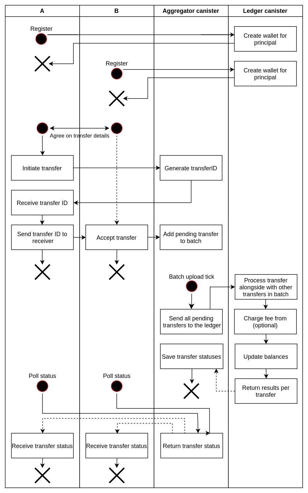

<h1 align="center">
    
     __  __     ______   __        
    /\ \_\ \   /\  == \ /\ \       
    \ \  __ \  \ \  _-/ \ \ \____  
     \ \_\ \_\  \ \_\    \ \_____\
      \/_/\/_/   \/_/     \/_____/
</h1>

<h4 align="center">A high performance ledger on the Internet Computer.</h4>

  <a href="#about">About</a> •
  <a href="#features">Features</a> •
  <a href="#api">API</a> •
  <a href="#architecture">Architecture</a> •
  <a href="#deployment">Deployment</a> •
  <a href="#contributing">Contributing</a> •
  <a href="#credits">Credits</a> •
  <a href="#support">Support</a> •
  <a href="#license">License</a>

---

Find more documentation on [GitHub Pages](https://research-ag.github.io/hpl/)

## About

The goal is to design and demonstrate a ledger on the IC(https://internetcomputer.org/) that can handle 10,000 transactions per second which are submitted individually by different end users via ingress messages. The number of ingress messages that the consensus mechanism of a single subnet can process is only in the order of 1,000 per second and is in fact rate limited by boundary nodes to a lower number (maybe around 400 per second). Therefore, to get to the desired throughput we plan to utilize 25 subnets.

The approach we take is based on the assumption that consensus is indeed the bottleneck and that computation and memory are not bottlenecks. Our approach has a single ledger canister which stores all account balances and settles all transactions. Transactions are not submitted to the ledger directly, though. Instead, end users submit their transactions to aggregators of which there are 25, all on different subnets. Aggregators batch up the transactions and forward them in batches to the ledger. The bottleneck is now the block space available for incoming cross-subnet messages on the subnet that hosts the ledger. If the size of a simple transaction is 100 bytes then each aggregator submits 40kB of data per second to the ledger. For all aggregators combined this occupies 1 MB of block space per second.

With some compression techniques we expect that the size of a simple transaction can be reduced to be around 20 bytes, which means a block space requirement of only 200 kB per second.

We expect the computational resources required to check 10,000 account balances and update 20,000 account balances per second to be within what a single canister can do.

We expect the memory resources required to store 100 million account balances to be within what a single canister can do.

We do not expect the ledger to be able to store the history of transactions, but this is not an argument against the design of having a single ledger canister. In fact, even distributing the ledger over 25 subnets would not change the fact that storing the entire history of transactions on chain is impossible. At 10,000 tps and 20 bytes per transaction the history grows by >500 GB per month. Therefore we propose to store only recent history in the ledger canister. The entire history has to be archived off chain but can always be authenticated against root hashes that are stored in the ledger.

## Features

The ledger is a multi-token ledger. This means that multiple tokens, differentiated from each other by a token id, can be hosted on the same ledger canister.

All transactions need to be explicitly approved by all parties involved, even the receiver. There are no deposits into arbitrary accounts without approval of the receiver.

Multiple token flows can happen atomically in a single transaction.

More than two parties can be part of a single transaction and all have to approve.

Any party can initiate the transaction: the sender, the receiver or even a third-party. The initiator is paying the fee.

## API

- [Terminology](#terminology)
- [Candid types of the API](#data-types)

### Terminology

**Canister** - conceptual computational unit, executes program in the Internet Computer blockchain [Read More](https://wiki.internetcomputer.org/wiki/Canisters_(dapps/smart_contracts))

**Principal** - an identifier for an entity on the IC such as a user, a canister (dapps/smart contracts), or a subnet. [Read More](https://wiki.internetcomputer.org/wiki/Principal)

**Subaccount** - essentially a wallet, owned by one principal and containing one type of tokens. Client principal can have many subaccounts with different and/or the same tokens 

### Candid types of the API

See [ledger.did](src/ledger/ledger.did) and [aggregator.did](src/aggregator/aggregator.did).

## Architecture

- [Context](#context-diagram)
  - [High-level user story](#high-level-user-story)
- [Containers](#containers-diagram)
  - [Low-level user story](#low-level-user-story)
- [Data structures](#data-structures)
  - [Ledger](#ledger)
  - [Aggregator](#aggregator)
    
### Context Diagram

    
     context diagram

With **HPL**, registered principals can submit and approve multi-token transactions. **HPL** charges fee for transaction

### High-level user story:

1. Principals **A** and **B** are registering themselves in **HPL**
2. Principals communicate directly to agree on the transaction details and on who initiates the transaction  (say **A**). 
3. **A** submits transaction on **HPL** and receives generated **transactionId** as response
4. **A** sends **transactionId** to **B** directly
5. **B** calls **HPL** with **transactionId** to get the transaction details
6. *B** calls **HPL** with **transactionId** to approve the transaction
7. **HPL** asynchronously processes the transaction
8. **A** and **B** can query HPL about the status of transaction (processing, success, failed)

---
### Canister diagram

    
     container diagram

**HPL** infrastructure consists of 1 **Ledger** and N **Aggregators** (N=25 by default).
- **Aggregator** canister is an entrypoint for principals. During the transaction process, both sender and receiver principal have to use one single aggregator. The aggregator is responsible for:
    - principals authentication
    - initial transaction validation
    - charging fee
    - collecting approvals
    - sending batched prepared transactions to the **Ledger**
    - receiving confirmation from the **Ledger** for each transaction
    - serving transaction status to principals
- **Ledger** canister has the complete token ledger. It is the single source of truth on account balances. It settles all transactions. It cannot be called directly by principals in relation to individual transactions, only in relation to accounts. The ledger is responsible for:
  - receiving batched transactions from aggregators
  - validation and execution of each transaction
  - saving all account balances
  - archiving latest transactions
  - providing list of available aggregators

### Low-level user story:

1. Principals **A** and **B** register themselves by [calling](#open-new-subaccount) ledger **L** API
2. **L** creates accounts for newly registered principals
3. **A** and **B** communicate directly to agree on the transaction details and on who initiates the transaction  (say **A**).
4. **A** [queries](#get-number-of-aggregators) available aggregators from **L** and chooses aggregator **G**
5. **A** calls a [function](#initialize-transaction) on **G** with the transaction details
6. **G** generates a **transactionId** and stores the unapproved transaction under this id
7. **G** returns **transactionId** to **A** as response
8. **A** sends **transactionId** and **G** principal to **B** directly
9. **B** [calls](doc/archived/README.md#get-transaction-status) **G** with **transactionId** to get the transaction details
10. **B** [calls](doc/archived/README.md#approve-transaction) **G** with **transactionId** to approve the transaction
11. **G** puts the transaction in the queue
12. At the next heartbeat, **G** sends a batch of queued transactions in a single cross-canister [call](#process-batch) to **L**
13. **L** processes the transactions in the batch in order, i.e. executes the transaction if valid and discards it if invalid
14. **L** returns the list of successfully executed transaction ids to **G**
15. **L** returns error codes for failed transaction ids to **G**
16. **A** and **B** can [query](#get-transaction-status) **G** about the status of a transaction id (processing, success, failed)

    

### Data Structures

#### Ledger

See [code](src/ledger/ledger.mo).

#### Aggregator

See [code](src/aggregator/aggregator.mo).

Summary lifecycle of the `Transaction` entity:

## Deployment

TBD

## Contributing

TBD

## Credits

TBD

## Support

TBD

## License

[Apache License](LICENSE)
