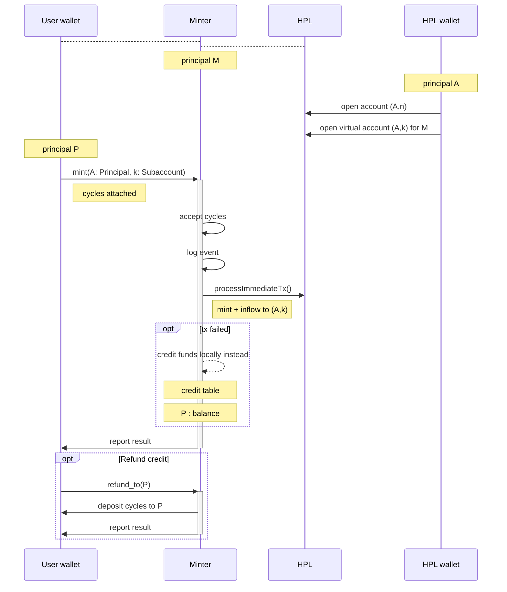
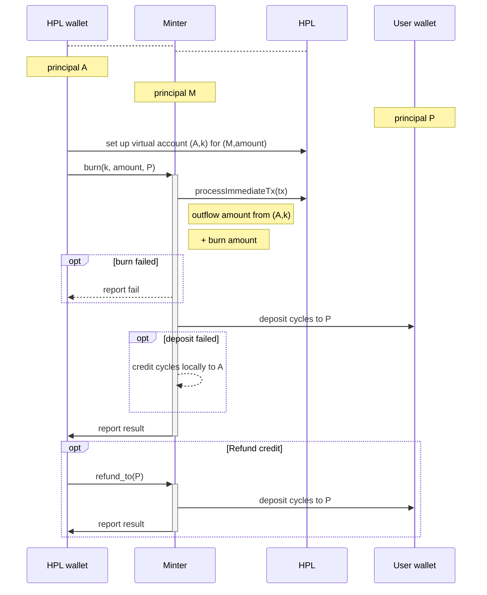

# Cycle minter

## Minting process

*User wallet* is a canister, e.g. a cycle wallet.

```mermaid
sequenceDiagram
User wallet-->Minter: 
Minter-->HPL:  
Note over Minter: principal M
Note over HPL wallet: principal A
HPL wallet->>HPL: open account (A,n)
HPL wallet->>HPL: open virtual account (A,k) for M
Note over User wallet: principal P
User wallet->>+Minter: mint(A: Principal, k: Subaccount)
Note right of User wallet: cycles attached
Minter->>Minter: accept cycles
Minter->>Minter: log event
Minter->>HPL: processImmediateTx()
Note right of Minter: mint + inflow to (A,k)
opt tx failed
  Minter-->>Minter: credit funds locally instead
  Note over Minter: credit table
  Note over Minter: P : balance
end
Minter->>-User wallet: report result
opt Refund credit
  User wallet->>+Minter: refund_to(P)
  Minter->>User wallet: deposit cycles to P
  Minter->>-User wallet: report result
end
```

## Burning process (requires virtual accounts)

```mermaid
sequenceDiagram
HPL wallet-->Minter: 
Minter-->HPL: 
Note over HPL wallet: principal A
Note over Minter: principal M
Note over User wallet: principal P
HPL wallet->>HPL: set up virtual account (A,k) for (M,amount)
HPL wallet->>+Minter: burn(k, amount, P)
Minter->>HPL: processImmediateTx(tx)
Note right of Minter: outflow amount from (A,k)
Note right of Minter: + burn amount
opt burn failed
  Minter-->>HPL wallet: report fail
end
Minter->>User wallet: deposit cycles to P
opt deposit failed
  Minter-->>Minter: credit cycles locally to A
end
Minter->>-HPL wallet: report result
opt Refund credit
  HPL wallet->>+Minter: refund_to(P)
  Minter->>User wallet: deposit cycles to P
  Minter->>-HPL wallet: report result
end
```
